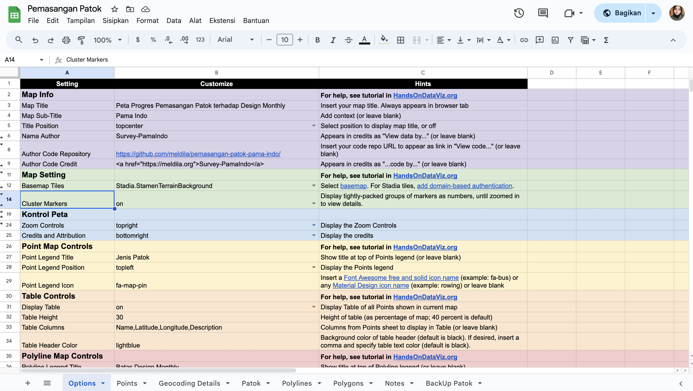

# Peta Leaflet Pemasangan Patok terhadap Design menggunakan Google Sheets
Peta leaflet ini terhubung dengan Google Sheets dan data GeoJSON di Github

# Link Github dan Google Sheets
- Peta leaflet : https://meldila.github.io/pemasangan-patok-pama-indo/
- Google Sheets : https://docs.google.com/spreadsheets/d/1hlKeq8ojhKY_89-304xmXX7c0FoXU2UeDjSLk02vcyo/edit#gid=0

# Google Sheets API agar Google Sheets dapat dikelola bersamaan
- Google Sheets API Key di-input-kan ke `google-doc-url.js`

# Referensi
Referensi ini dari *Hands-On Data Visualization* https://handsondataviz.org/leaflet-maps-with-google-sheets.html
